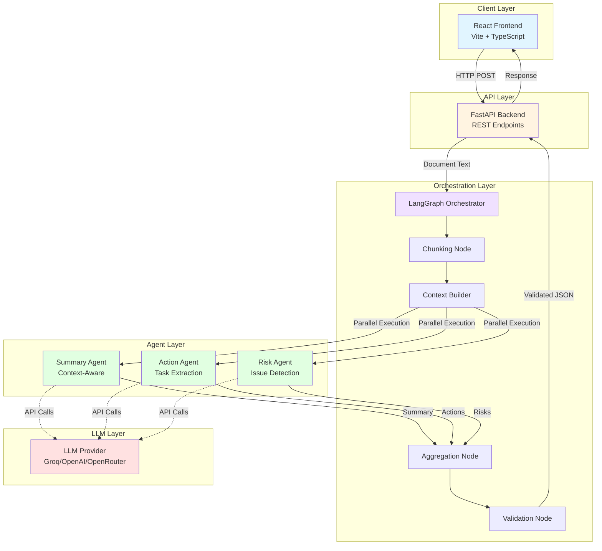
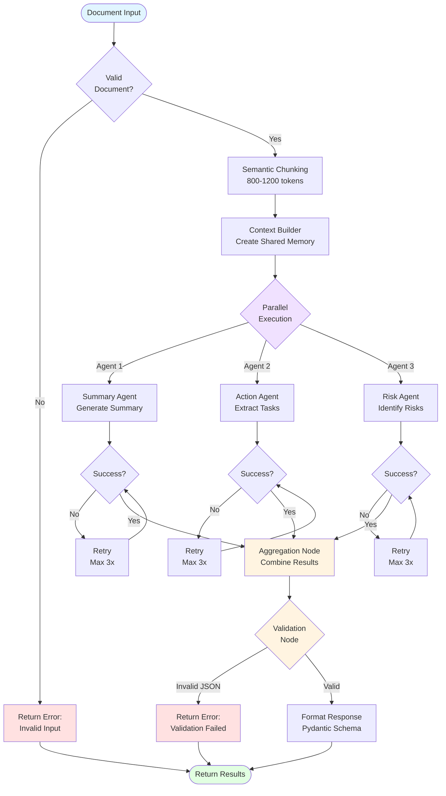
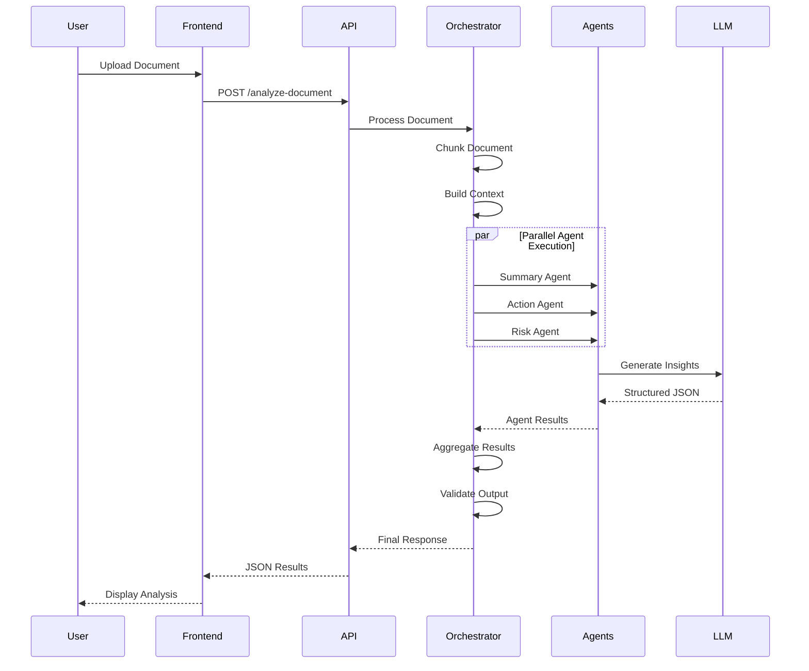

# Multi-Agent Deep Document Intelligence System

A production-ready multi-agent AI system using **LangGraph** for orchestrating autonomous agents that analyze long unstructured documents and generate structured insights.

## 🏗️ Architecture

The system uses a **central orchestrator** with three independent autonomous agents:

1. **Context-Aware Summary Agent** - Generates comprehensive document summaries
2. **Action & Dependency Extraction Agent** - Identifies tasks, owners, deadlines, and dependencies
3. **Risk & Open-Issues Agent** - Detects risks, open questions, and assumptions

### System Architecture



### Orchestration Workflow



### Data Flow



## 🚀 Features

### Backend
- **Multi-Agent Coordination**: Independent agents with shared contextual memory
- **Structured JSON Outputs**: Validated with Pydantic schemas
- **Async Architecture**: High-performance parallel processing
- **Robust Error Handling**: Retry mechanisms and graceful failures
- **Semantic Chunking**: Intelligent document splitting for long texts
- **LangGraph Orchestration**: Clear, explainable workflow
- **Performance Optimized**: ≤6 seconds for 1000-word documents

### Frontend
- **Modern UI**: Beautiful, responsive design with Tailwind CSS
- **Real-time Updates**: Live analysis progress with React Query
- **File Upload**: Drag & drop or paste document text
- **Rich Results**: Interactive display of summaries, actions, and risks
- **Health Monitoring**: Real-time backend status indicator
- **Toast Notifications**: User-friendly feedback for all actions
- **Type Safety**: Full TypeScript implementation

## 📦 Technology Stack

### Backend
- **Framework**: Python, FastAPI, LangGraph, Pydantic
- **LLM**: Groq / OpenAI / OpenRouter
- **Vector Store**: ChromaDB
- **Orchestration**: LangGraph
- **Async**: asyncio, aiohttp

### Frontend
- **Framework**: React 18, TypeScript
- **Styling**: Tailwind CSS
- **Build Tool**: Vite
- **HTTP Client**: Axios
- **State Management**: React Query (@tanstack/react-query)
- **UI Components**: Lucide React (icons), React Hot Toast (notifications)

## 🛠️ Installation

### Prerequisites

- Python 3.10+
- API key for Groq, OpenAI, or OpenRouter

### Setup

1. **Clone and navigate to the project**

```bash
cd "/Users/hrushi/Desktop/college/kalyan/Multi Agent Deep Document"
```

2. **Create virtual environment**

```bash
python -m venv venv
source venv/bin/activate  # On Windows: venv\Scripts\activate
```

3. **Install dependencies**

```bash
pip install -r requirements.txt
```

4. **Configure backend environment**

```bash
cp .env.example .env
```

Edit `.env` and add your API key:

```env
LLM_PROVIDER=groq
GROQ_API_KEY=your_actual_api_key_here
```

5. **Setup frontend**

```bash
cd frontend
npm install
cd ..
```

The frontend `.env` is optional (defaults work for local development).

## 🎯 Usage

### Quick Start (Full Stack)

**Recommended: Start both frontend and backend**
```bash
# From project root
./start_fullstack.sh
```

This starts:
- Backend API: `http://localhost:8000`
- Frontend UI: `http://localhost:3000`
- API Docs: `http://localhost:8000/docs`

### Start Backend Only

**Option 1: Using the start script (Recommended)**
```bash
cd backend
./start_server.sh
```

**Option 2: Manual start with PYTHONPATH**
```bash
cd backend
export PYTHONPATH=$PWD:$PYTHONPATH
source ../venv/bin/activate
uvicorn app.main:app --reload --port 8000
```

### Start Frontend Only

```bash
cd frontend
./start_frontend.sh
```

Or manually:
```bash
cd frontend
npm run dev
```

### Stop All Servers

```bash
./stop_servers.sh
```

### Access Points

| Service | URL | Description |
|---------|-----|-------------|
| **Frontend UI** | http://localhost:3000 | Main web application |
| **Backend API** | http://localhost:8000 | REST API endpoints |
| **API Docs** | http://localhost:8000/docs | Interactive Swagger documentation |
| **ReDoc** | http://localhost:8000/redoc | Alternative API documentation |

### Using the Web Interface

1. Open http://localhost:3000 in your browser
2. Upload a document file (.txt, .md) or paste text directly
3. Click "Analyze Document"
4. View the results:
   - Executive Summary
   - Action Items & Dependencies
   - Risks & Open Issues

### Analyze a Document

**Endpoint**: `POST /analyze-document`

**Request**:

```json
{
  "document_text": "Your long document text here (500+ words)..."
}
```

**Response**:

```json
{
  "summary": "Comprehensive summary of the document...",
  "action_items": [
    {
      "task": "Complete the API integration",
      "owner": "John Doe",
      "deadline": "2024-03-15",
      "dependencies": ["Database setup", "Authentication module"]
    }
  ],
  "risks_and_open_issues": [
    {
      "issue": "Budget constraints not clearly defined",
      "type": "risk",
      "impact": "high"
    }
  ]
}
```

### Python Client Example

```python
import requests

response = requests.post(
    "http://localhost:8000/analyze-document",
    json={"document_text": "Your document text here..."}
)

result = response.json()
print(result["summary"])
```

## 🧪 Testing

Run the smoke test:

```bash
cd backend
python -m pytest tests/test_smoke.py -v
```

Run all tests:

```bash
python -m pytest tests/ -v
```

## 📁 Project Structure

```
Multi Agent Deep Document/
├── backend/                        # FastAPI Backend
│   ├── app/
│   │   ├── main.py                # FastAPI application
│   │   ├── api/
│   │   │   └── endpoints.py       # API routes
│   │   ├── ai/
│   │   │   ├── orchestrator.py    # LangGraph orchestration
│   │   │   ├── agents/
│   │   │   │   ├── summary_agent.py
│   │   │   │   ├── action_agent.py
│   │   │   │   └── risk_agent.py
│   │   │   └── prompts.py         # Agent prompts
│   │   ├── models/
│   │   │   └── state.py           # LangGraph state definitions
│   │   ├── schemas/
│   │   │   └── document.py        # Pydantic schemas
│   │   └── utils/
│   │       ├── chunking.py        # Document chunking
│   │       ├── llm_factory.py     # LLM provider setup
│   │       └── validation.py      # Output validation
│   └── tests/
│       └── test_smoke.py          # Smoke tests
│
├── frontend/                       # React Frontend
│   ├── src/
│   │   ├── components/
│   │   │   ├── DocumentUpload.tsx # Upload & input
│   │   │   └── AnalysisResults.tsx # Results display
│   │   ├── api/
│   │   │   └── client.ts          # Axios client
│   │   ├── hooks/
│   │   │   └── useDocumentAnalysis.ts # React Query hooks
│   │   ├── types/
│   │   │   └── index.ts           # TypeScript types
│   │   ├── App.tsx                # Main component
│   │   ├── main.tsx               # Entry point
│   │   └── index.css              # Global styles
│   ├── public/                    # Static assets
│   ├── package.json               # Node dependencies
│   └── vite.config.ts            # Vite configuration
│
├── start_fullstack.sh             # Start both servers
├── stop_servers.sh                # Stop all servers
├── requirements.txt               # Python dependencies
├── .env                          # Backend configuration
├── README.md                      # This file
├── FRONTEND_SETUP.md             # Frontend guide
├── FULLSTACK_GUIDE.md            # Complete system guide
└── QUICK_REFERENCE.md            # Quick command reference
```

## ⚙️ Configuration

Key environment variables:

| Variable | Description | Default |
|----------|-------------|---------|
| `LLM_PROVIDER` | LLM provider (groq/openai/openrouter) | groq |
| `GROQ_API_KEY` | Groq API key | - |
| `OPENAI_API_KEY` | OpenAI API key | - |
| `MAX_CHUNK_SIZE` | Maximum chunk tokens | 1200 |
| `MIN_CHUNK_SIZE` | Minimum chunk tokens | 800 |
| `LLM_TIMEOUT` | LLM call timeout (seconds) | 30 |
| `PARALLEL_AGENTS` | Enable parallel agent execution | true |

## 🎨 Agent Design

### Summary Agent
- Preserves intent and critical decisions
- Context-aware summarization
- No hallucination

### Action & Dependency Agent
- Extracts structured tasks
- Identifies owners and deadlines
- Maps task dependencies

### Risk & Open-Issues Agent
- Detects implicit risks
- Identifies assumptions
- Classifies by impact level

## 📊 Performance

- **Target**: ≤6 seconds for 1000-word documents
- **Strategy**: Async LLM calls, parallel agent execution
- **Optimization**: Semantic chunking, context compression

## 🔒 Error Handling

- JSON parsing validation
- LLM retry mechanisms
- Graceful degradation
- Structured logging
- Input validation

## 🚀 Deployment

This application can be deployed to various cloud platforms. See [DEPLOYMENT.md](DEPLOYMENT.md) for detailed instructions.

### Quick Deployment Options

#### Backend
- **[Render](https://render.com)** (Recommended) - Free tier, auto-deploy from GitHub
- **[Railway](https://railway.app)** - $5 free credit/month
- **[Heroku](https://heroku.com)** - Free tier with credit card

#### Frontend
- **[Vercel](https://vercel.com)** (Recommended) - Free tier, optimized for React
- **[Netlify](https://netlify.com)** - Free tier, easy setup

### Environment Variables Setup

For deployment, you'll need to configure these environment variables:

**Backend:**
```bash
LLM_PROVIDER=groq
GROQ_API_KEY=your_actual_api_key
MAX_CHUNK_SIZE=1200
MIN_CHUNK_SIZE=800
LLM_TIMEOUT=30
PARALLEL_AGENTS=true
LOG_LEVEL=INFO
```

**Frontend:**
```bash
VITE_API_URL=https://your-backend-url.com
```

See [DEPLOYMENT.md](DEPLOYMENT.md) for step-by-step deployment guides.

## 🌐 Live Demo

> **Coming Soon!** 
> 
> Once deployed, add your live demo URL here:
> - **Frontend**: `https://your-app.vercel.app`
> - **API Docs**: `https://your-backend.onrender.com/docs`

### Screenshots

*Add screenshots of your deployed application here to showcase in your resume!*

## 🤝 Contributing

This is a production-ready implementation demonstrating:
- Clear orchestration logic
- Multi-agent coordination
- Robust memory mechanism
- Clean modular design
- Explainable architecture

## 📝 License

MIT License

## 🙋 Support

For issues or questions, please check the code documentation or raise an issue.

---

**Built with LangGraph 🦜🔗**
